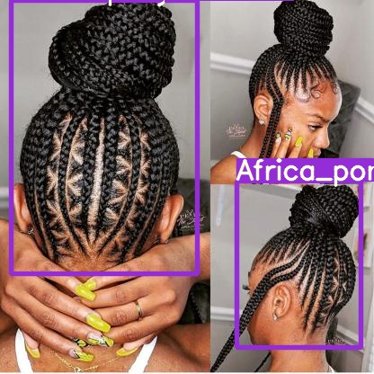
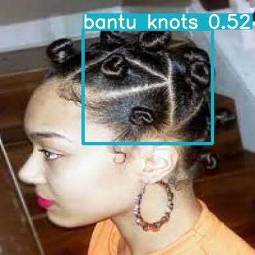

# Identifying-African-Hairstyles-Using-Yolov5
This is a computer vision project aim to detect different African hairstyles 
## INTRODUCTION 
African hairstyle has always been part of  African culture and it symbolizes the origin, social status, spiritual status of an individual. The aim of this project is to identify various AFRICAN Hairstyles using ROBOFLOW YOLO v5 
## Data Collection and Preprocessing
About 800 images of three classes of hairstyles were scraped annotated as 1. Africa Ponytail  2. cornrows 3. Bantu Knots. Images were preprocessed using [Roboflow](https://blog.roboflow.com/getting-started-with-roboflow/)
and more images were generated through argumentation by Horizontal flip,rotation,Grayscale,blur .Thia process was used in order to make the model familiar with real life data
## Installations
-For Annotation process check out  [labelImg](https://github.com/tzutalin/labelImg)
- Check out [Yolov5](https://pytorch.org/hub/ultralytics_yolov5/)
The notebook

## Result 

## Demo App

##  Article

